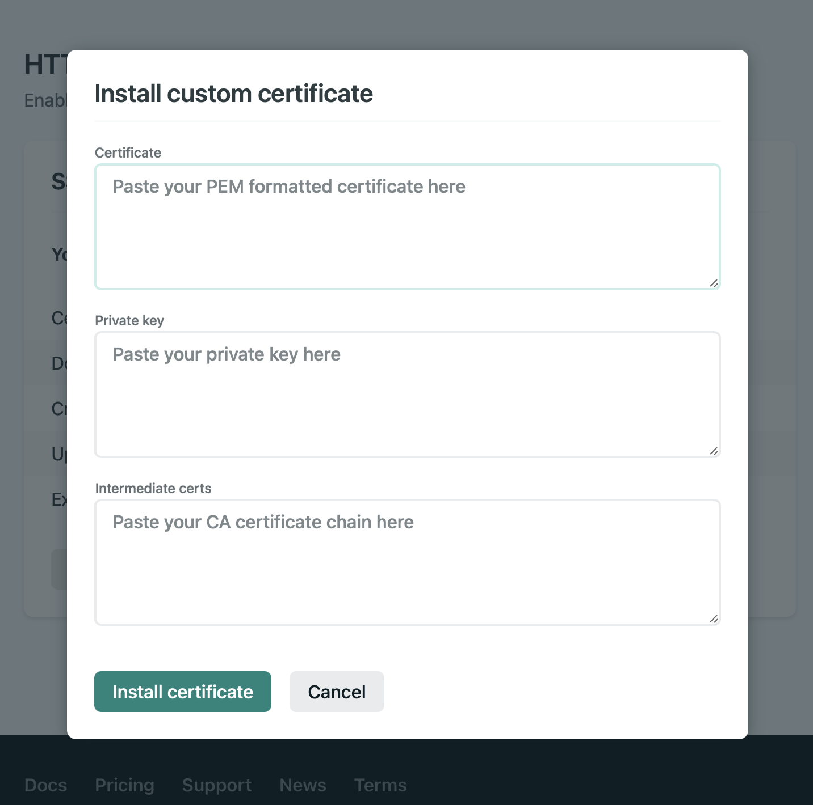
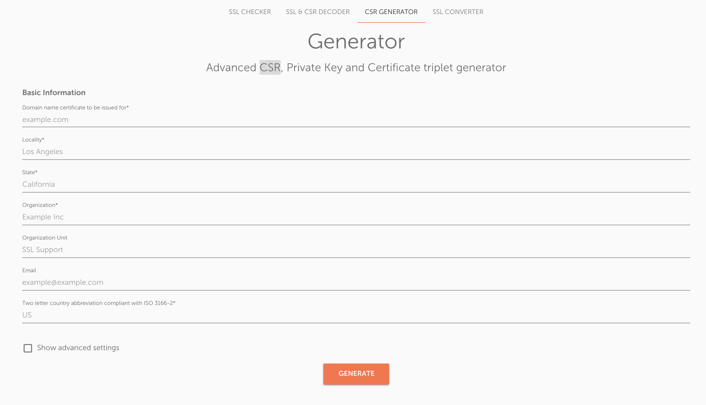
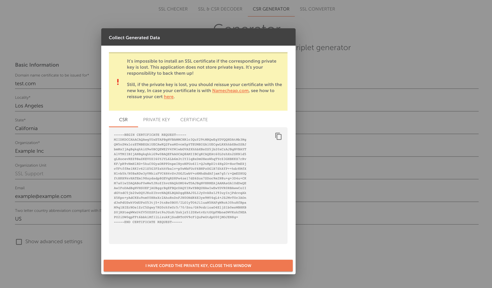
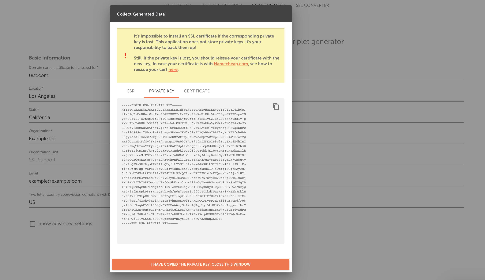

> Netlify quickly conquered hearts of developers with it's convenience and ease of use. If you still don't know what Netlify is - I definitely recommend checking their [welcome page](https://docs.netlify.com). I am not affiliated with Netlify - I do think you should try it out.

## Intro

This post is about SSL certificates with Netlify. If you need some details on what SSL is, [here's a read](https://kinsta.com/knowledgebase/how-ssl-works/). By default, you don't need to care of setting up HTTPS with Netlify - they issue and maintain a [Let's Encrypt](https://docs.netlify.com) certificate for you. But sometimes you need to provide identity information to your users which Let's Encrypt doesn't support. This is when paid certificates come into play.

Apart from that, modern domains like _.dev_ come bundled with a free SSL certificate out of the box, so why not use them?

> Keep in mind that SSL that you get with your domain is **not** forever free - it's only free for the first year.

## If you didn't miss anything

In most cases, if you obtained `certificate.pem`, `private.key` and `cert-ca.pem` (or something like that) for your SSL, you won't have any issues with this as you simply need to put three strings in corresponding inputs - the certificate itself, its private key, and so called Certificate Authority (CA) information. When it comes to Netlify, you just need to:

1. go to [netlify.com](https://netlify.com/)
2. pick your site
3. click **⚙️ Domain settings**
4. scroll down to **HTTPS** section
5. click **Install custom certificate**

You should see something like this:



What's going to happen next is quite self-explanatory. Put the contents of `certificate.pem` to the **Certificate** textarea, then put `private.key` content to **Private key** textarea, and I bet you know what to do with the last one. Then smash the `Install certificate` button and you're good. It might take a couple of minutes to apply the changes.

## If it's not that easy

Sometimes, though, you find yourself not having either the CA certificate, or the private key.

### No CA

So, you have the cert and the key, but no CA. It happened to me when I issued SSL using Cloudflare, if I can recall correctly. This may apply to other SSL providers as well. Anyways, this one is easy to fix - you just need to find the correct CA cert with your favourite search engine. E.g. for [Cloudflare](https://cloudflare.com) they can be found [here](https://developers.cloudflare.com/ssl/origin-configuration/origin-ca).

### No Private Key

A bit more complex problem is when you lose/miss/forget to copy-paste your private key. It happens if the SSL provider doesn't give it to you - most probably because they don't have it either. This happens because some providers require you to generate a certificate/key pair yourself. Then you create a CSR (Certificate Signing Request) with that pair and send it to the provider. So, they don't know your private key, and can't share it with you. By definition of `private`.

#### How CSR is usually created

The CSR request looks almost the same as a certificate, a bit shorter. There's a whole bunch of ways to do that, you can check [How to generate CSR code](https://www.namecheap.com/support/knowledgebase/article.aspx/467/14/how-to-generate-csr-certificate-signing-request-code/) by Namecheap if you want to pick the one that fits you the most.

After you send the provider your CSR, they let you download a pack of files, where you can find the certificate, a CA certificate (maybe), but no private key. There might be a `.p7b` file which is also usually referred to as PKCS#7. Or there might be a PKCS#12 file. Or no file at all. And if you have, for instance, a `.p7b` file and you try to put its content to the Netlify **Private key** textarea, you'll get a **_Certificate is not a valid PEM certificate_** error.

#### What if you lose the private key

At this point, there are two options:

- If you created a CSR locally using [Apache OpenSSL](https://www.openssl.org), you need to find the right `private.key`. This should help:

```sh
# Check where OpenSSL saves stuff
$ openssl version -d

# Find all issued keys
# OPENSSLDIR - whatever previous command said OPENSSLDIR is
$ grep -r --exclude-dir=log --exclude-dir=ssh --exclude=*history -I -l -e '-----BEGIN PRIVATE*' -e '-----BEGIN RSA*' -e ‘-----BEGIN EC*’ OPENSSLDIR 2> /dev/null

# Check each key against your certificate
# CERT - path to certificate.pem you want to compare to
# KEY - path to a key found by the previous command
$ (openssl x509 -noout -modulus -in CERT | openssl md5 ;\
   openssl rsa -noout -modulus -in KEY | openssl md5) | uniq
```

- If you used a third-party tool, chances are you just missed the private key contents when you were creating a CSR. Go to you provider and request reissuing your SSL cert. Create a new CSR using the same tool and be careful not to skip the private key - just copy it for when you will use it with Netlify.

#### Step-by-step CSR creation with Decoder.link

If you don't want to miss it again, here's a short guide with Decoder.link that allows you to quickly create a CSR:

1. Go to [https://decoder.link/csr_generator](https://decoder.link/csr_generator). No signup required!

2. Fill in the form:
   

3. Click **Generate**
4. You'll see something like this (poor `test.com`):
   
5. Don't rush into clicking the orange button. First open the **PRIVATE KEY** tab and copy the private key somewhere.
   
6. Now come back to CSR, copy it and pass it along to your SSL provider. When all required checks are completed, you will be able to get your SSL certificate files.
7. Take the certificate and CA certificate values from those files, and add the private key we just saved.

That's it, you are now ready to use your custom SSL certificate! 🙌
