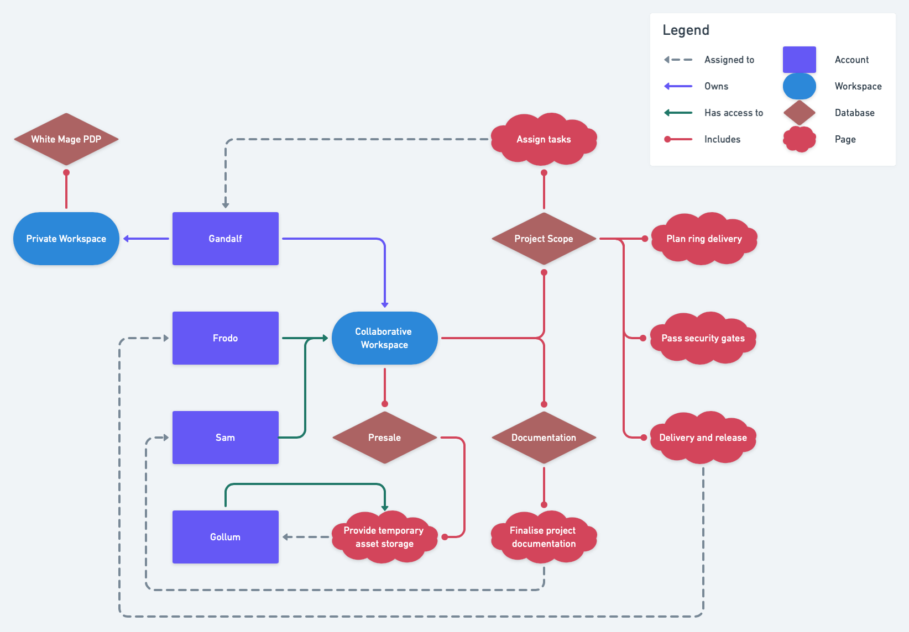
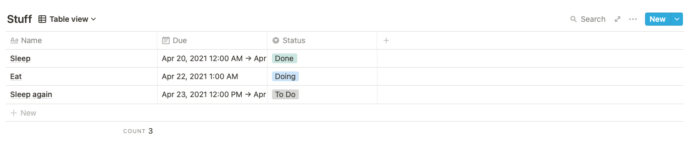
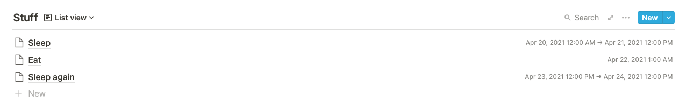
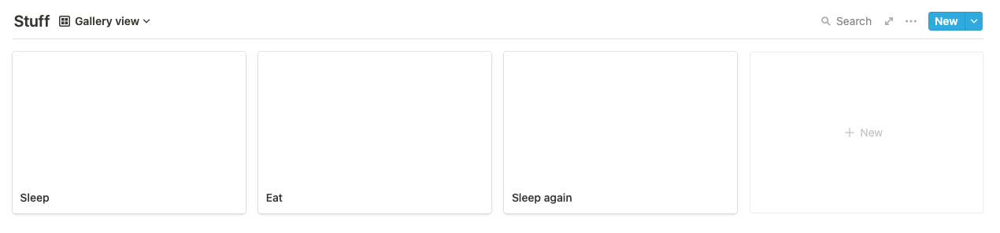
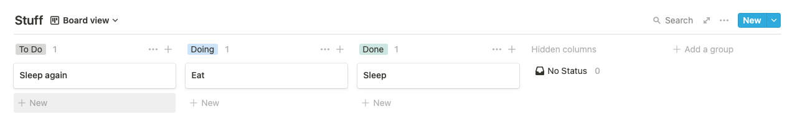
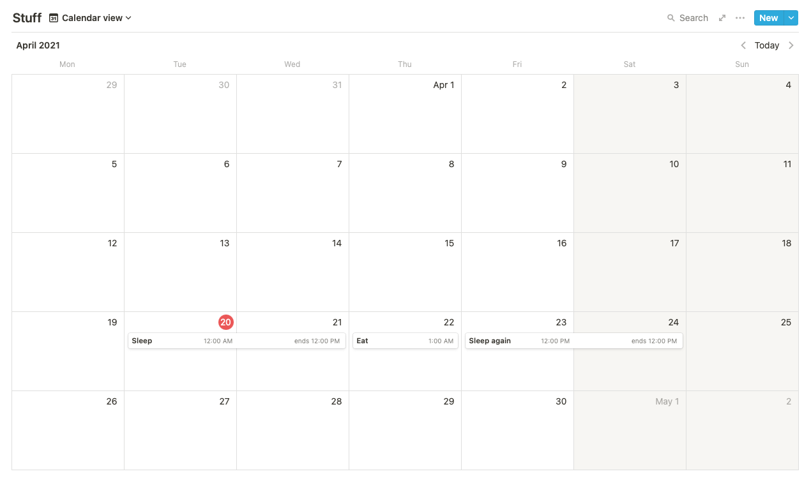
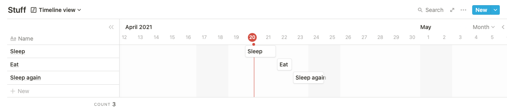

You've probably heard of [Notion](https://notion.so). Even if you haven't - no worries. This article is to explain. 🙌

> Notion is an all-in-one worplace, where you can write, plan, collaborate and get organized - it allows you to take notes, add tasks, manage projects & more.
>
> &copy; [KeepProductive.com](https://www.keepproductive.com/blog/notion-for-beginners)

In a nutshell, it's just a _block_ storage for your data. When I say data, I literally mean almost any kind of data. It can be text, images, PDFs, links, and what not. Those _blocks_ of data can be composed together on a **_page_**. A **_page_** itself is also a _block_, but of a higher kind. **_Pages_** can also be composed together to form **databases**, which are, you guessed it, also _blocks_. You can also add additional information, or `properties`, to **_pages_** if they are inside **databases**. They are, of course, _blocks_ as well. **Databases**, as well as **_pages_** that don't belong to any databases, are directly attached to a WORKSPACE. Technically, all your _blocks_ belong to a WORKSPACE, but they follow the hierarchy of nesting. WORKSPACES belong to **ACCOUNTS**. Here's a diagram depicting this complicated relationship:

Now let's break everything down.

## Accounts

When you sign up with AppleID, Google, or with your email and password - you create an account. Accounts are free but there are special features that can be enabled with paid subscription.

### Pricing

The free plan is **Personal**, which means that only you can access it. You can invite up to 5 guests to specific pages and they will be able to make changes on those pages on your behalf. You can upload files of up to 5 MB each. You can use up to `3 Timeline views` in your private workspace. More on that later.

There is also **Personal Pro** plan which costs \$4 per month if you pay annually (or \$5 if you pay monthly). For this money, you get priority support, unlimited guests, unlimited file sizes for uploads, and 30 days version history.

**Team** plan for \$8 per user (account) per month yearly (\$1 per account per month monthly) provides you access to Collaborative Workspace. You also get admin tools and permission groups to granularly assign who can see, do and break what. You can alo create up to `5 Timeline views`.

**Enterprise** plan (\$20 per account per month yearly, \$25 per account per month monthly) saves version history of your pages forever, allows `unlimited Timeline views`, adds SSO support, special bulk operations, dedicated manager, early access to new features and some other Enterprise stuff.

https://twitter.com/orlowdev/status/1264275845587374081

## Workspaces

There are basically two types of workspaces. One is private, every Notion account has its own private workspace. Another workspace is called Collaborative. Accounts with Team access can invite other accounts to join in. Permissions in collaborative workspace can be granularly assigned to every account in that workspace. That's all about workspaces.

## Databases & Pages

Databases provide you a convenient way to look at a collection of pages and add special properties to those pages. To avoid falling into a rabbit hole - databases are just pages with links to other pages. Keep in mind though, that you can _inline_ a database on a page, which an be done as many times as you like, or you can _turn_ a page into database. If you do so, you won't be able to do anything with this page itself - only with database records. And one more thing: you can display links to pages in a database in multiple views depending on what you want to achieve:

- `Table view`, where each row is a page, and each column is a block of additional information
  
- `List view`, basically Database view with only one column
  
- `Gallery view` - a grid, where each page is displayed as a card
  
- `Kanban view`, basically Gallery view but columns of the grid are grouped by a page property
  
- `Calendar view` - whatever you would expect from a calendar view
  
- `Timeline view`, which needs a property of a `date` type that will be used for laying down sausages on the grill ([see #pricing](#pricing))
  

## Properties

If a page is a database entry, it can be assigned properties. As many as you want or need. They can be of different kinds.

| Name             | Description        | Special features                                              | Example                   |
| ---------------- | ------------------ | ------------------------------------------------------------- | ------------------------- |
| Text             | Just text          | -                                                             | Never used it             |
| Number           | Numeric value      | Supports integers, decimals, percents and a few currencies    | Prices, progress          |
| Select           | Choose one         | Each item can be given a name and a color (both may repeat)   | Status                    |
| Multy-select     | Choose some        | Same as select, but more than one value can be picked         | Tags                      |
| Date             | Date & time        | Supports timezones, from -> to, date formats, reminders       | Due date, reminder        |
| Person           | Notion account     | -                                                             | Assignee, reporter        |
| Files & media    | Attach stuff       | Allows embedding links as well, provides a preview            | Attachments               |
| Checkbox         | true \|\| false    | Can be clicked to change state                                | Done?                     |
| URL              | Clickable link     | -                                                             | Never used it             |
| Email            | Clickable email    | -                                                             | Never used it             |
| Phone            | Clickable phone    | -                                                             | Never used it             |
| Formula          | Add logic          | Date operations, text operations, number operations, booleans | Next due, progress, taxes |
| Relation         | Connect pages      | One-to-many, many-to-many, same DB, other DBs, backreference  | Task -> Project           |
| Rollup           | Relation + formula | Calculate values for a property of a related page             | Task subtasks number      |
| Created time     | -                  | -                                                             | Audit                     |
| Created by       | -                  | -                                                             | Audit                     |
| Last edited time | -                  | -                                                             | Audit                     |
| Last edited by   | -                  | -                                                             | Audit                     |

## Blocks

As I already mentioned, previous things are examples of blocks. Notion supports many other blocks as well, including paragraphs, headings of different levels, etc. And the list of supported blocks grows with new features added to Notion. You can get the full list of supported blocks by tapping a "/" button when you are anywhere on a notion page. Here's what's currently available:

### Basic

- **Text** - simple text
- **Page** - create a nested page and put a link to it where the block was added
- **To-do list** - a checkbox + text field
- **Heading 1** - top level heading (shortcut: #)
- **Heading 2** - lower level heading (shortcut: ##)
- **Heading 3** - lowest level heading (shortcut: ###)
- **Bulleted list**
- **Numbered list**
- **Toggle list** - a list item with extended description that can be hidden or shown when clicked on the triangle icon
- **Quote**
- **Divider** - a horizontal line
- **Link to page** - link to existing page
- **Callout** - a coloured box with text and an emoji

### Inline

- **Mention a person** - the person will be notified and given a link to the place where you menion them
- **Mention a page** - the page will also get a back reference to the page where it was mentioned
- **Date or reminder** - the reminder will push a notification to you when the time comes
- **Emoji** - quickly put an emoji on the page
- **Inline equation** - put a math symbol in the text

### Database

- **Table - Inline**
- **Board - Inline**
- **Gallery - Inline**
- **List - Inline**
- **Calendar - Inline**
- **Timeline - Inline**
- **Table - Full Page** - Full page table disallows adding other blocks to the page
- **Board - Full Page** - Full page board disallows adding other blocks to the page
- **Gallery - Full Page** - Full page gallery disallows adding other blocks to the page
- **List - Full Page** - Full page list disallows adding other blocks to the page
- **Calendar - Full Page** - Full page calendar disallows adding other blocks to the page
- **Timeline - Full Page** - Full page timeline disallows adding other blocks to the page
- **Create linked database** - Link existing database to the page

### Media

- **Image**
- **Web bookmark**
- **Video**
- **Audio**
- **Code**
- **File**

### Embeds

- **Embed** - universal way of embedding that can resolve the type of embed based on provided link
- **Google Drive**
- **Tweet**
- **GitHub Gist**
- **Google Maps**
- **Figma**
- **Abstract**
- **Invision**
- **Framer**
- **Whimsical**
- **Miro**
- **PDF**
- **Loom**
- **Typeform**
- **CodePen**

### Advanced Blocks

- **Table of contents** - generates the table of contents from headings on the page
- **Block equation** - the difference from inline equation is that you can embed a full equation, not just specific mathematical symbols in the middle of the text
- **Template button** - allows you to assign steps that should happen automatically when you press the button, e.g. creating a new page with predefined content
- **Breadcrumb** - show path to current document considering its nesting. Also visible at the top of the Notion frame

## Conclusion

Thanks for reading! The idea of this article is to serve as a reference for further Notion-related posts I am about to create. So, stay tuned!
